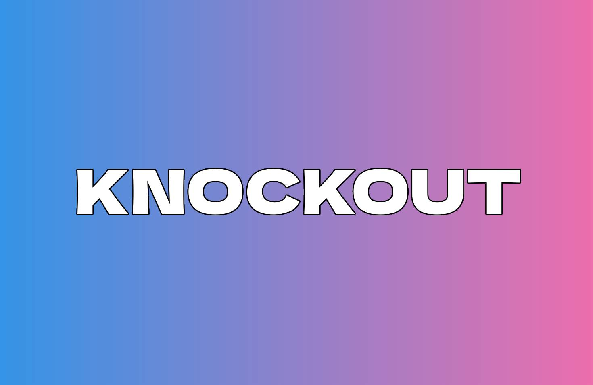

# KNOCKOUT.lua


Dominate HVH with Precision Strikes using our simple and effective script.

### Description

An open sourced script written in Lua for [NeverLose.cc](https://en.neverlose.cc/) and [Gamesense.pub](https://gamesense.pub/) (soon) CS:GO Cheating software. Lua scripts enhance the existing capabilities of cheats. Some are private, others are public. Some cost money and others don't. KNOCKOUT is completely free and open sourced and includes feature that you really need rather than all the other visually appealing or "extra" stuff that's out there.

### Features

- Killsay
- Defensive Anti-Aim
- Anti-Exploit
- Tickbase Teleport
- Lua Config Saver
- Grenade Fix
- FPS Boost: Disable client rendering, teamate rendering, low-aimbot scan
- Aspect Ratio Changer
- Clantag Changer
- Hide Shots
- Leg Break
- Logs
- Word Hitmarker (very naughty)
- Custom Scope
- Auto Safety (automatically swaps to pistol to prevent stab or tazer)

## Getting Started

### Installing

<!-- * Download the script from the lastest release. -->
1. Copy paste source code of the script.
2. Create a new script from the neverlose in game menu.
3. Click the three dots beside the script then click on "Edit".
4. Paste the source code, click "Save" and "Run".
<!-- * Copy paste or drag and drop the file in your CS:GO directory. 
If you are using neverlose.cc:
```
C:\Program Files (x86)\Steam\steamapps\common\Counter-Strike Global Offensive\nl\scripts
```
If you are using gamesense.pub:
```
C:\Program Files (x86)\Steam\steamapps\common\Counter-Strike Global Offensive\
``` -->

### Help

If you are experiencing any bugs or issues, please DM me on [discord](https://discord.com/) @devnrk

### Authors

Main developer - [Devnrk](https://github.com/devnrk) 
Co-developer - [ChromemilK](https://github.com/chromemilk)

### Version History

* 0.6 (latest)
    * Various bug fixes and optimizations.
    * Cleaned codebase.
    * Slightly changed killsays.
    * Fixed a bug with defensive anti aim not forcing defensive exploit at all times.

* 0.5
    * Various bug fixes and optimizations.
    * Improvements to the logging system.

* 0.4
    * Various bug fixes and optimizations.
    * Altered defensive aa timer.       

* 0.3
    * Various bug fixes and optimizations.
    * Reworked UI.
    * Added scope check for indicator's alpha.
    * Added Hideshots indicator.
    * Auto TP experimental reworked.
    * Added new FPS mitigations.
    * Reworked Killsays.
    * Added lua name for missed logs (wasn't there before).
    * Added "Glow" option for world hitmarker.
    * Added Option to enable/disable Anti Exploit.
    * Added "Force Defensive" for defensive AA which lowers the odds of being backtracked or hit when defensive is active.
    * Reworked safety taser. Now if you don't have a taser, it will fallback to your secondary weapon. The second option pulls out the next available weapon (could be anything).

* 0.2
    * Various bug fixes and optimizations.
    * Fixed clantag sometimes not working.
    * Added random and spin presets for defensive aa.
    * Added new speed mode for defensive aa (experimental).
    * Added fake flick.
    * Reworked leg breaker.
    * Removed Double tap instant recharge.
    <!-- * See [commit change]() or See [release history]() -->
* 0.1
    * Initial Release.

### License
```
MIT License

Copyright (c) [2024] [devnrk]

Permission is hereby granted, free of charge, to any person obtaining a copy
of this software and associated documentation files (the "Software"), to deal
in the Software without restriction, including without limitation the rights
to use, copy, modify, merge, publish, distribute, sublicense, and/or sell
copies of the Software, and to permit persons to whom the Software is
furnished to do so, subject to the following conditions:

The above copyright notice and this permission notice shall be included in all
copies or substantial portions of the Software.

THE SOFTWARE IS PROVIDED "AS IS", WITHOUT WARRANTY OF ANY KIND, EXPRESS OR
IMPLIED, INCLUDING BUT NOT LIMITED TO THE WARRANTIES OF MERCHANTABILITY,
FITNESS FOR A PARTICULAR PURPOSE AND NONINFRINGEMENT. IN NO EVENT SHALL THE
AUTHORS OR COPYRIGHT HOLDERS BE LIABLE FOR ANY CLAIM, DAMAGES OR OTHER
LIABILITY, WHETHER IN AN ACTION OF CONTRACT, TORT OR OTHERWISE, ARISING FROM,
OUT OF OR IN CONNECTION WITH THE SOFTWARE OR THE USE OR OTHER DEALINGS IN THE
SOFTWARE.
```
<!-- ## Acknowledgments -->
